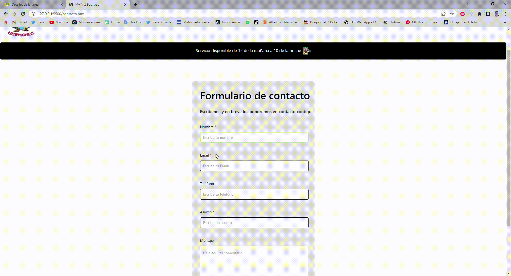

# RESTAURANTE POLLOS HERMANOS

Se ha realizado un proyecto de la página de un restaurante de comida rápida con HTML y CSS

Para ver como es pulsa en este enlace: https://alex65cast.github.io/Proyecto-Semana2-Restaurante/index.html

## Herramientas 🚀

Para realizar este proyecto se ha usado el IDE de Visual Studio Code y Bootstrap.

* [VisualStudioCode](https://code.visualstudio.com/) - El IDE web usado
* [Bootstrap](https://getbootstrap.com/) - Biblioteca de dependencias

## Funcionalidades ⚙️

La página esta dividida por una serie de funcionalidades que explicaremos a continuación:

* _Carrousel de fotos_: Tiene en la parte principal una serie de imagenes que representan al restaurante como podemos ver

* _Pop-up de subida_: Como su nombre indica aparecerá un pop-up cuando bajemos a cierto punto de la página que al pulsarlo nos facilitará la subida

* _Carta_: Podemos ir directamente a la carta del restaurante pulsando directamente en "Nuestra carta" 

* _Contacto_: Para ir al apartado de contactos es tan sencillo como pulsar en el apartado de contacto en la parte superior. Tambien podemos por la web a la página principal estemos donde estemos pulsando en "POLLOS HERMANOS"

*_Aviso de enviar_: Estando en nuestro formulario no nos dejará enviar nuestra petición hasta que no rellenemos los campos correspondientes, si no nos aparecerá un error.

Obviamente nuesta web es responsive para la mayoría de los dispositivos donde se observe esta web, haciendo más cómoda la experiencia del usuario
---
Con ❤️ por [Alejandro Castejón](https://github.com/alex65cast) 😊